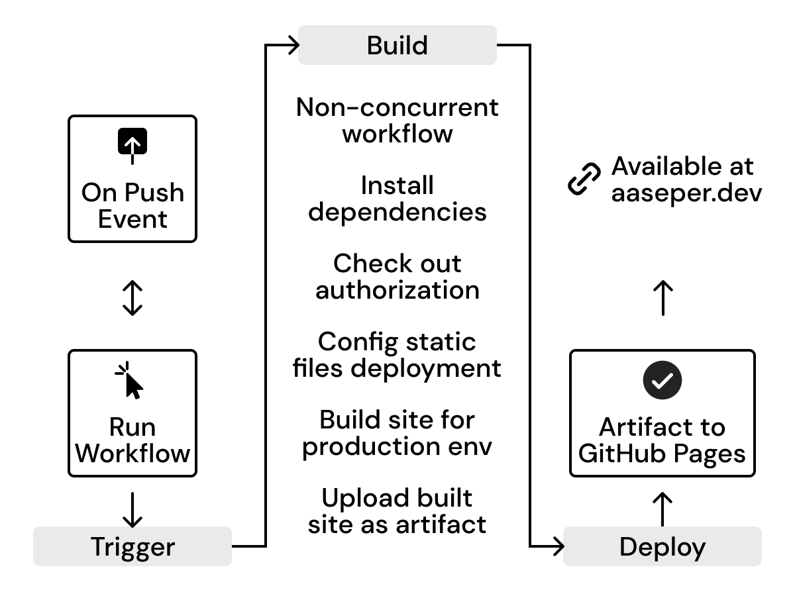

# Automated Hugo Portfolio Deployment with GitHub Actions

## Application of a Continuos Integration and Continuous Deployment of a Hugo static website with GitHub Actions

## Table of contents

1. **[Authorship](#1-Authorship)**
2. **[Description](#2-Description)**
3. **[Architecture and technology diagram](#3-Architecture-and-technology-diagram)**

## 1 Authorship

    Original publish date: Jul, 2024
    License: MIT
    Author: Alejandro Asensio Pérez

## 2 Description

This repository demonstrates a CI/CD workflow for a Hugo static website portfolio using GitHub Actions. It automates the entire build and deployment process, ensuring your portfolio is always up-to-date and readily available online. This eliminates the need for manual intervention, saving you time and reducing the risk of errors.

This CI/CD workflow offers a streamlined and efficient solution, mimicking the robust deployment practices used by leading businesses.  Thanks to GitHub Actions and GitHub Pages, you benefit from this powerful automation while keeping the cost and environment setup simple.

## 3 Architecture and technology diagram

This diagram visualizes the automated deployment process. Here's what happens:

1. Push code changes: When you update your code and push it to GitHub (main branch), the workflow starts automatically.
2. Build for production: The workflow builds your website for a live environment, including installing dependencies, configuring deployment settings, and building the final site.
3. Upload artifact: The built website is uploaded for deployment.
4. Deploy to GitHub Pages: Finally, the uploaded website is deployed to GitHub Pages, making it accessible at your domain.

This workflow is entirely automated, eliminating the need for manual intervention. In case of a build failure, GitHub Actions will pinpoint the exact step where the error occurred, aiding in efficient debugging.